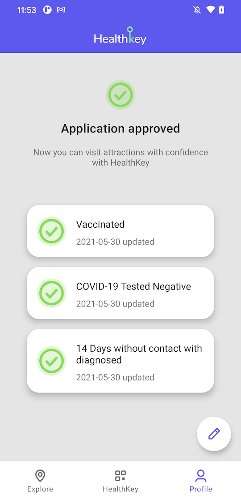

<!-- PROJECT LOGO -->
 

  

  <h3 align="center">HealthKey</h3>

  

    The key to your safe trip!
     
     
    <a href="https://docs.google.com/presentation/d/1YYk5p7MyG7W-k4zXXncC-9Qj5zzEJHGP9Yde7L_zPwc/edit?usp=sharing">Pitch Deck</a>
    ·
    <a href="https://youtu.be/SIcR-WCw000">Video Intro</a>
    ·
    <a href="https://drive.google.com/file/d/1BgCP_uiMCnEsywIELe9L5mNdlcjnvFr6/view?usp=sharing">Downloadable APK</a>
  

<!-- ABOUT THE PROJECT -->
## About HealthKey

HealthKey is the final product of [2021 APEC App Challenge](https://2021apec.devpost.com/). It includes three core features:

- Explore: The map presents the attractions or stores that support HealthKey, meaning these places are safe to visit.
- HealthKey: A business owner could scan the authenticated QR code presented by the user to ensure the working space.
- Profile: A checklist for the user to identify the application status of HealthKey QR code.

For more information, check out the [slides](https://docs.google.com/presentation/d/1YYk5p7MyG7W-k4zXXncC-9Qj5zzEJHGP9Yde7L_zPwc/edit?usp=sharing) and the [video](https://youtu.be/SIcR-WCw000)!

## Screenshots

&nbsp; &nbsp; &nbsp; &nbsp;
 
&nbsp; &nbsp; &nbsp; &nbsp;

<!-- LICENSE -->
## License

Distributed under the MIT License. See `LICENSE` for more information.

